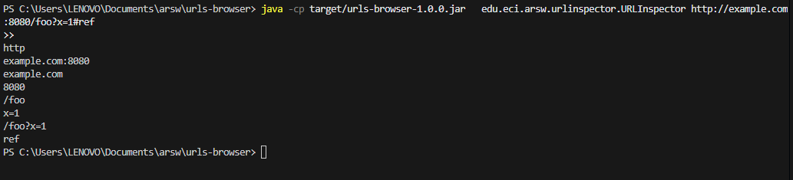
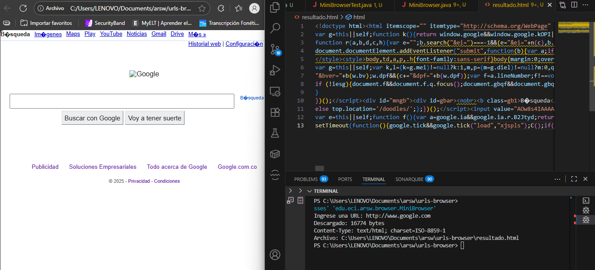

# urls-browser

## David Santiago Castro Sierra

### Utilidades de red para practicar:

Ejercicio 1 – URLInspector: crea un objeto URL y desglosa sus componentes (protocol, authority, host, port, path, query, file, ref) imprimiéndolos en líneas separadas y en ese orden.

Ejercicio 2 – MiniBrowser: pide una URL (por argumento o por consola), la lee con openStream() y guarda el resultado en resultado.html (o la ruta que indiques con --out=). Luego puedes abrir ese archivo en tu navegador favorito.

Ambos están escritos en Java 21, con Maven ≥ 3.9, y cuentan con pruebas JUnit 5 que no dependen de Internet (levantan un pequeño HTTP server embebido).

Cómo compilar y ejecutar
1) Compilar (genera target/classes y el JAR)

Desde la carpeta del proyecto:

mvn -q -DskipTests=false test package

- Ejecuta pruebas y empaqueta el JAR (por ejemplo: target/repo-urls-browser-1.0.0.jar).

- Si solo quieres compilar sin pruebas:

mvn -q -DskipTests package

2) Ejecutar desde VS Code – Terminal integrada

- Abrir terminal

- Asegúrate de estar en la carpeta del proyecto:

cd repo-urls-browser

Ejecutar sin usar el JAR (directo desde target/classes):

Linux/macOS:

java -cp target/classes edu.eci.arsw.urlinspector.URLInspector --url=http://example.com:8080/foo?x=1#ref
java -cp target/classes edu.eci.arsw.browser.MiniBrowser --url=https://example.org --out=resultado.html

Windows (PowerShell)

java -cp target\classes edu.eci.arsw.urlinspector.URLInspector --url=http://example.com:8080/foo?x=1#ref
java -cp target\classes edu.eci.arsw.browser.MiniBrowser --url=https://example.org --out=resultado.html

Ejecutar con JAR (si no definiste Main-Class, usa -cp + FQN):

java -cp target/repo-urls-browser-1.0.0.jar edu.eci.arsw.browser.MiniBrowser --url=https://example.org

### Descripción detallada de las clases
1) edu.eci.arsw.urlinspector.URLInspector (Ejercicio 1)

Propósito: dada una URL (por argumento o usando un valor por defecto), crea un java.net.URL e imprime ocho componentes en este orden exacto:

- getProtocol() – esquema (http, https, file, etc.)

- getAuthority() – autoridad (host + : + puerto si está explícito)

- getHost() – nombre de host o IP

- getPort() – puerto numérico; -1 si no se especificó en la URL

- getPath() – ruta (/foo/bar)

- getQuery() – parte de consulta (x=1&y=2) o null si no hay

- getFile() – path + ?query si existe (por compatibilidad histórica)

- getRef() – fragmento (#ref) o null si no hay

Entrada:

- Primer argumento como URL o --url=<...>.

- Si no se proporciona nada, usa por defecto http://www.google.com/.

Salida: ocho líneas, una por cada componente (en el orden anterior).

Errores: si la URL no es válida (MalformedURLException), imprime un mensaje claro en stderr.

2) edu.eci.arsw.browser.MiniBrowser (Ejercicio 2)

Propósito: actuar como un mini-navegador muy simple:

- Solicita una URL (por argumento --url= o primer arg; si no, la pide por consola).

- Abre un InputStream con url.openStream() (estilo URLReader).

- Lee el contenido línea por línea con BufferedReader.

- Escribe en resultado.html (o lo que indiques con --out=).

- Reporta tamaño aproximado en bytes (sumando longitudes UTF-8 + \n) y la ruta absoluta del archivo.

Entrada:

- --url=<...> | primer argumento = URL | si se omite, pide por stdin.

- --out=<ruta> para personalizar el archivo de salida (opcional; por defecto resultado.html).

Salida:

- Línea con bytes descargados (aproximados para texto).

- Línea con la ruta del archivo generado.

Errores: captura IOException con mensaje claro (DNS, permisos, etc.).

### Argumentos de línea de comandos y E/S
URLInspector

- --url=http://host:puerto/ruta?query#ref o primer argumento como URL.

- Sin argumentos → usa http://www.google.com/.

Ejemplo de salida (para http://example.com:8080/foo?x=1#ref):

http
example.com:8080
example.com
8080
/foo
x=1
/foo?x=1
ref

MiniBrowser

- --url=... (o primer arg como URL)

- --out=archivo.html (opcional)

Dónde queda resultado.html?

- En el directorio actual desde el que ejecutas. Puedes confirmarlo con:

- Linux/macOS: pwd && ls -l

- Windows: cd y dir

Abrir en el navegador:

- Windows (PowerShell): start resultado.html

- Linux: xdg-open resultado.html

- macOS: open resultado.html

Pruebas (JUnit 5) y cómo ejecutarlas

Las pruebas no dependen de Internet:

- Levantan un com.sun.net.httpserver.HttpServer local efímero.

- Sirven una pequeña página HTML de ejemplo en http://127.0.0.1:<puerto>/page.

- Verifican:

 - URLInspector: que imprime los 8 componentes correctos para una URL construida localmente.

 - MiniBrowser: que genera resultado.html (o ruta custom) y que el contenido coincide con el HTML servido.

Ejecutar todas las pruebas:

mvn -q -DskipTests=false test

Notas de diseño y decisiones técnicas

- Estilo URLReader: se usa new URL(...).openStream() con BufferedReader y try-with-resources para lectura segura.

- Codificación: se usa UTF-8 explícito para evitar sorpresas (acentos, eñes y demás alegrías).

- Conteo de bytes: aproximación para texto (bytes línea UTF-8 + salto). Para binarios, habría que contar bytes sin interpretación.

- URLInspector usa la API de java.net.URL:

 - getPort() devuelve -1 si no viene explícito en la URL.

 - getFile() es path + ?query (histórico; se mantiene por compatibilidad).

 - URLs IPv6 deben ir con corchetes: http://[2001:db8::1]:8080/.

- Errores: mensajes claros en stderr; no se lanzan stacktraces al usuario final.

Solución de problemas (Troubleshooting)

- “No se generó resultado.html”: Recuerda que se genera al ejecutar MiniBrowser, no al compilar. Verifica la carpeta actual y permisos de escritura. Usa --out= con una ruta donde tengas permisos.

- “URL inválida” (URLInspector): Revisa el esquema (http:// o https://) y que no falte : → http//example.com 

- “Unknown host / DNS”: prueba con IP directa o con el servidor local python -m http.server.

- SSL/HTTPS handshake: puede ocurrir por proxies corporativos o certificados. Prueba con http://127.0.0.1:8000 para descartar red.

- Windows + rutas con espacios: usa comillas:
java -cp "target\repo-urls-browser-1.0.0.jar" edu.eci.arsw.browser.MiniBrowser --url=https://example.org --out="C:\Users\TuUsuario\Desktop\resultado.html"

- Ejecución desde VS Code: asegúrate de estar en la carpeta del proyecto (cd repo-urls-browser) y de haber corrido mvn package antes.
### Resultados de ejecucion de los programas en el ordenador:

Para Ejercicio 1:
Desde la terminar de nuestro editor ingresar el siguiente comando para cambiar el link por defecto o darle run normal desde el editor a URLInspector

java -cp target/urls-browser-1.0.0.jar   edu.eci.arsw.urlinspector.URLInspector http://example.com:8080/foo?x=1#ref

Para el ejercicio 2:

Corremos la clase Mini browser desde el editor e ingresamos el link que queramos o colocamos un link como este en la terminal del editor

java -cp target\classes edu.eci.arsw.browser.MiniBrowser --url=https://example.org

